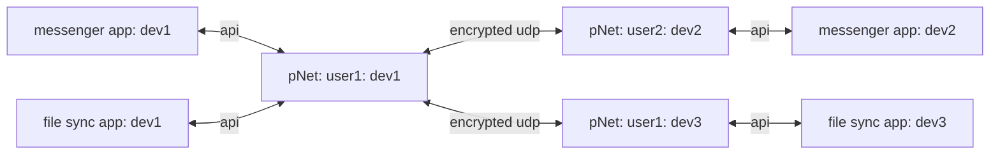

dev1, dev2, etc... means device 1, 2, etc... signifies that the service is on the same device with everything that has the same label

user1 means that it is the same user that owns and operates the device and the installed apps and the pNet node

the above diagram shows how a message from the messenger app on device 1 would be sent to the messenger app on device 2 via pNet nodes.  It also shows  how a file from file sync app on device 1 can be sent to the file sync app on device 3 via pNet nodes.

pNet is responsible for maintaining network location information and encryption keys to connect and send data packets to other pNet nodes, which then forward that data to the appropriate app on its device.  

In a sense the pNet is like a persons little black book with addresses and phone numbers to contact friends who have been added.  It also contains addresses and phone numbers for other devices owned by that user, in the analogy the users clubhouse.  When it sends udp packets to another pNet that pNet node needs to be able to identify which user, device, and app sent it and decrypt the contents before forwarding the contents to the appropriate app.  
