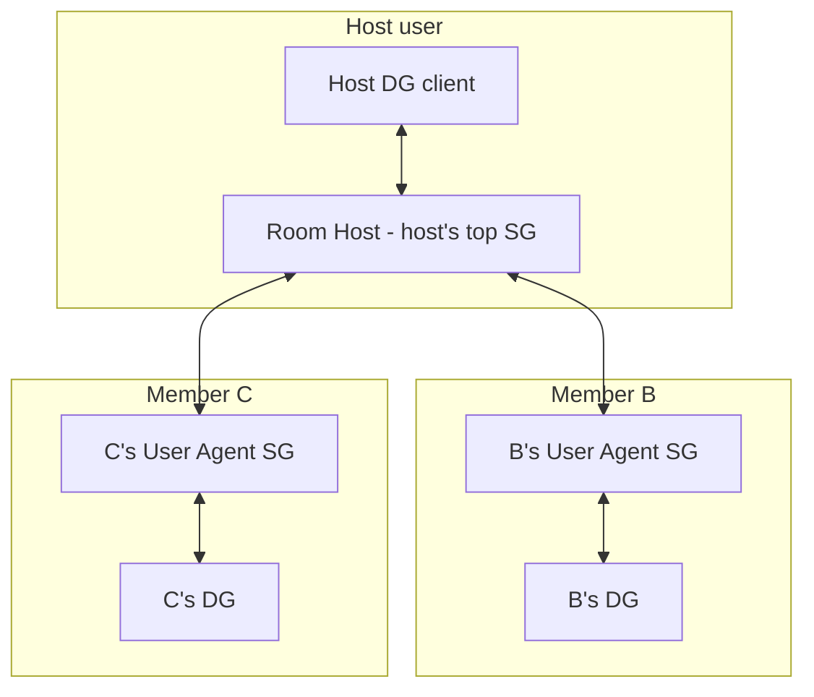
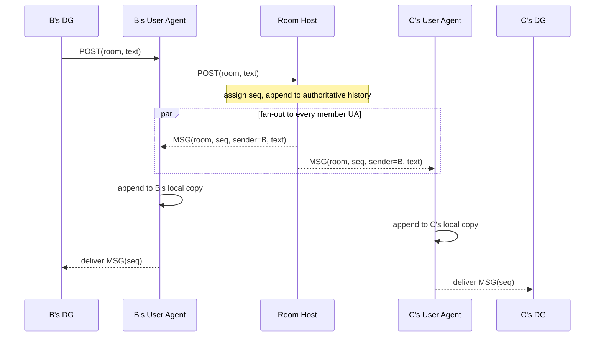

# pNet Chat

A Discord-style app: persistent chat rooms with text history, plus live voice and
screen share. It runs entirely on top of the pNet app API — pNet stays a dumb
pipe whose only job is "get bytes from one device's app to another device's app."
pNet has no concept of a room, a member, or a message. Everything in this document
is implemented inside the app using only the four primitives pNet already gives an
app:

| Op | Name | What the app uses it for |
|---|---|---|
| `0x00` | `app_register` | Announce ourselves on this device; get our per-device `app_id` + `token`. |
| `0x02` | `app_get_data` | Read the tree: our own devices, our contacts, their devices (grade/`sg_rank`), and which of their devices run this app. |
| `0x03` | `app_send_packet` | Send an opaque app payload to a `(device_uuid, app_id)`. |
| `0x04` | `OP_PUSH` | Receive an inbound app payload (with its sender) from pNet. |

The unit `pnet_deliverer` already proves the 1:1 case (register → get-data →
send → push). pNet Chat is the multi-party, history-keeping generalization, with a
reliable central host per room.

## Goals

- Persistent chat rooms with full message history, scrollable even when other
  members are offline.
- Live voice and screen share between room members.
- A trust model that fits pNet: the people in a room do **not** all have to be
  contacts of each other.
- A reliable home for each room that does not depend on a laptop or phone being
  awake.
- Zero changes to pNet core. If a feature needs pNet to understand "rooms," the
  design is wrong.

## The dumb-pipe contract (what pNet does NOT do for us)

We assume nothing beyond message delivery between contacts. In particular pNet
does **not** give us: rooms, groups, broadcast/multicast, ordering across
messages, retransmission of app payloads, persistence of app payloads, or any
guarantee that a sent packet arrives. Every one of those is the app's job. pNet
*does* give us: routing between two devices (subject to the contact rule below),
a per-device view of our contacts and their devices/apps, and best-effort
delivery of one payload to one app.

We also assume one deployment fact that the whole design leans on:

> **The app is installed and user-approved on every SG a participating user owns.**

This is what lets a flaky DG (laptop/phone) delegate the reliable work to an
always-on SG. "Installed and approved" is load-bearing — see *Discovery*, because
`app_get_data` only reveals a contact's `user_approved` apps.

## Roles and topology

Two roles, both played by the app running on an SG:

- **User Agent (UA)** — the instance of this app on a user's **top-ranked SG**
  (lowest `sg_rank` among that user's `grade == SG` devices). Every user has at
  most one acting UA. The UA is that user's hub for *every* room they are in: it
  holds that user's copy of room history, talks to peers on that user's behalf,
  and does last-mile delivery to that user's own DGs.
- **Room Host (RH)** — for a given room, the UA of the user who created it. The RH
  is the single authority for that room: it assigns message order, holds the
  authoritative history, and fans messages out to every member's UA. A node is an
  RH for the rooms it owns and an ordinary UA (member) for rooms others own.

DGs are thin clients. A DG never participates in a room directly; it talks only to
its own user's UA.



Note what this buys us: **every packet on the diagram is between two contacts or
between one user's own devices.** B and C may be total strangers; they never
exchange a packet, because all room traffic stars through the RH, and the host is
a contact of both. This is the core idea — the friendship graph only has to be a
star centered on the host, never a full mesh.

## Trust and membership model

- A room is **owned by one user** (the creator) and hosted on that user's RH.
- **The host must be a contact of every member.** This is the only friendship
  constraint, and it falls straight out of the topology: the RH can only route to
  devices of its own contacts.
- **Members need no relationship to one another.** Joining a room is implicit
  consent to be visible (messages, voice, face) to co-members; the host vouches
  for everyone. The member list is shown to all members so there are no surprises.
- **Only the host adds or removes members**, and only from the host's own contact
  list. The RH enforces this (see *Permissions*).

## Discovery and addressing

When the RH needs to reach member B, it resolves B from its own `app_get_data`
snapshot:

1. Find B in `contact_users`.
2. Among B's devices, pick the one with `grade == SG` and the lowest `sg_rank` —
   B's top SG, i.e. B's UA device.
3. On that device, find the app whose **alias matches our well-known alias**
   (`pnet-chat`) and `user_approved == true`. Read back **that device's**
   `app_id`.
4. Address packets to `(B_UA_device_uuid, that_app_id)`.

Two rules make this robust, both forced by how the pNet API actually works:

- **Discover by alias, address by the id you read back.** `app_id` is a fresh
  UUID minted per registration (`handlers.rs` `app_register`), so it is *not* a
  shared constant across installs. The only stable cross-device identifier is the
  alias we choose. We match on alias and use the per-device id we read from the
  snapshot as `dest_app_id`.
- **Discovery is eventually consistent — tolerate staleness.** `app_get_data`
  returns whatever pNet has last synced about a contact's public state, and only
  lists `user_approved` apps. A member who just installed/approved the app, or
  whose SG rank just changed, may not be visible yet. The app must not treat
  "not yet visible" as "not a member." Fallbacks:
  - The RH may send the room invite to **whatever** contact device of the member
    *is* currently visible; the member's app forwards the invite to that user's
    UA internally.
  - Each UA, on coming online, **announces itself** to the RHs of rooms its user
    belongs to (a `HELLO` carrying the UA's `(device_uuid, app_id)`), so the RH
    learns the correct address without waiting on public-state sync.

The invite the RH sends always carries the RH's own `(device_uuid, app_id)` so a
member's UA knows where to send posts back up.

## Posting a message

Every user interacts with a room only through their own UA. A post from any
member therefore takes the same path, and the RH is the single point that assigns
order:



The originator sees their own message only once the RH has ordered it — that
round trip *is* the delivery confirmation and guarantees everyone applies messages
in the same order.

## History and backfill

- The **authoritative** history lives on the RH.
- Each member's **UA keeps that member's own copy** of every message it receives.
  So a member can scroll history even while the host (or anyone else) is offline —
  their own SG already has it.
- A DG holds only a cache; on reconnect it pulls from its own UA.

New member joins: when the host adds B, the RH sends an invite, B's UA announces
itself, and the RH streams the room's history to B's UA. **Default: full history**
(Discord-like); configurable per room to "from join point."

Retention is app-defined; default is keep-all on both the RH and each UA. (A
later phase can add per-room retention windows.)

## Delivery and ordering guarantees

The RH assigns a monotonic `seq` per room. That single sequencer is the entire
consistency model — no CRDTs, no distributed consensus.

- **RH ↔ UA is the reliable leg.** Both ends are always-on SGs. The RH retries a
  `MSG` to a member UA until acked, and each UA tracks its last-applied `seq` per
  room. On reconnect a UA sends `HISTORY_REQ(room, since=cursor)` and the RH
  replays the gap. Application is idempotent by `(room, seq)`.
- **UA → DG is best-effort.** The UA pushes to the user's online DGs; a DG that
  missed messages pulls from its own UA on reconnect. Last-mile loss never costs a
  message because the UA already persisted it.

This is the split that makes the system durable without making the pipe smart: put
the guarantees on the leg between two reliable nodes, and let the flaky leg heal by
pulling.

## Host failover

The RH is reliable but not immortal. Because the app runs on **all** of the host
user's SGs, the RH **mirrors authoritative room state** (membership, history, and
the `seq` counter) to the host user's other SG agents. This is just one user's own
devices syncing their own app state — trivially trusted, same-user routing.

When the host's rank-1 SG drops:

1. The host's rank-2 SG (which holds the mirror) becomes the acting RH.
2. The host user's `sg_rank` change propagates through pNet's normal public-state
   sync, so member UAs eventually re-resolve the host's current top SG via
   `app_get_data`. The new RH can also proactively send `HOST_MOVED` to the
   members it knows.
3. Member UAs re-announce (`HELLO`) to the new RH and resume from their `seq`
   cursor.

If the host has only one SG, the room freezes (read-only from local copies) until
that SG returns — an explicit, acceptable degradation, not a correctness bug.

## Members without an SG

A DG-only user has no SG to act as their UA. For such a member the RH addresses the
member's **DG directly** and keeps a per-member delivery cursor, caching messages
and re-delivering when the DG reconnects. Reliability is lower (a DG can be offline
arbitrarily long and the RH must hold its backlog), but the model still works.
Recommended UX: nudge active users to install the app on an SG.

## Voice and screen share

Live media is a separate, **ephemeral** path. It is never appended to history and
never `seq`-ordered; frames carry their own timestamps and late frames are dropped.

- Media frames ride the same `app_send_packet` primitive as text — pNet just moves
  bytes and never knows it is carrying audio or video.
- The RH acts as a **selective forwarding unit (SFU)**: each speaker/streamer sends
  one media stream up to the RH, which forwards it to the other members.
- **This concentrates bandwidth on the RH.** Text fan-out is nothing; voice is
  modest; screen-share fan-out for a large room is heavy. v1 targets small rooms
  and documents this as the known hotspot and the scaling limit.

Open refinement (see *Open questions*): for latency, media may travel
RH ↔ member **DG** directly (the RH already may address member devices, all
contacts), skipping the member-UA hop that control/history traffic uses. v1 may
route media through the UA for simplicity and revisit.

## App-level protocol

All payloads below are the opaque bytes carried in the `0x03` / `0x04` body; pNet
does not parse them. Envelope:

```
[version:u8][msg_type:u8][room_id:16][body...]
```

`room_id` is a UUID the RH generates at room creation. Message types:

| Type | Direction | Purpose |
|---|---|---|
| `OPEN_ROOM` | host DG → own UA | Create a room; UA becomes its RH. Body: room name, initial member uuids. |
| `INVITE` | RH → member (UA or DG) | "You're in room R." Body: room name, host user uuid, RH `(device_uuid, app_id)`, current member list. |
| `HELLO` | member UA → RH | Announce this user's UA address for the room. Body: UA `(device_uuid, app_id)`, last-applied `seq`. |
| `ADD_MEMBER` / `REMOVE_MEMBER` | host DG → RH | Change membership (host only; target must be a host contact). |
| `POST` | member DG → own UA → RH | Submit a chat message. Body: text (or attachment ref). |
| `MSG` | RH → member UA → DG | Ordered, fanned-out message. Body: `seq`, sender uuid, text, timestamp. |
| `HISTORY_REQ` | UA/DG → RH/own UA | Request backlog. Body: `since_seq`. |
| `HISTORY_RESP` | RH/UA → requester | Replay of messages after `since_seq`. |
| `ACK` | UA → RH | Confirm applied up to `seq` (drives RH retry/backlog). |
| `HOST_MOVED` | new RH → members | Host failover notice. Body: new RH `(device_uuid, app_id)`. |
| `MEDIA_FRAME` | streamer → RH → members | Ephemeral voice/screen frame. Body: stream id, codec, timestamp, payload. Not persisted, not `seq`-ordered. |

Byte-level field layouts are deferred to implementation; this table fixes the
protocol's shape and the routing of each message.

## Permissions and authority checks (all at the RH)

The RH is the only node that grants authority, and it checks everything against its
own `app_get_data` snapshot — never trusting a payload's self-claims:

- **Control messages** (`OPEN_ROOM`, `ADD_MEMBER`, `REMOVE_MEMBER`) are accepted
  only when the sender device is one of the **host user's own devices** (sender
  `device_uuid` ∈ our `owner.user.devices`). This is what "only the host manages
  the room" means in code.
- **`ADD_MEMBER` targets** must be in the host's `contact_users`. Reject otherwise
  — you cannot add a stranger.
- **`POST` / `HELLO`** are accepted only from a device belonging to a **current
  member** (sender's user is in the room's member list). A non-member's packet is
  dropped.
- A member UA, symmetrically, only accepts `MSG` for a room from that room's
  current RH address.

## Open questions

- **Media path**: route voice/screen through each member's UA (simple, one model
  for everything) or RH ↔ member-DG directly (lower latency, RH must track each
  member's online DGs)? Lean direct-to-DG for media once v1 text is solid.
- **Media at scale**: at what room size does single-RH SFU forwarding stop being
  acceptable, and is a relay-tree or peer-assisted path ever worth the added
  complexity given the contact-only routing rule?
- **History retention defaults**: keep-all forever vs a per-room window; who can
  configure it.
- **Leaving a room**: does a departed member keep their local history copy, and
  does `REMOVE_MEMBER` request deletion or just stop the feed?
- **Attachments/large payloads**: chunking strategy over the single-payload `0x03`
  primitive, and whether large blobs reuse the `pnet_deliverer` path.
- **Multiple rooms, one UA**: confirm a single UA cleanly multiplexes many rooms
  (it should — `room_id` scopes everything).

## Implementation phasing

| Phase | Scope |
|---|---|
| 1 | App skeleton: register (`pnet-chat` alias), get-data, send, push. Reuse the `pnet_deliverer` client scaffolding. |
| 2 | UA/RH role selection: a DG resolves and delegates to its own top SG; that SG runs the RH/UA logic. |
| 3 | Room lifecycle on the RH: `OPEN_ROOM`, membership list, `INVITE`, `HELLO`, permission checks. |
| 4 | Text messaging: `POST` → RH `seq` assignment → `MSG` fan-out; per-UA local history. |
| 5 | Reliability: `ACK` + RH retry, `HISTORY_REQ`/`HISTORY_RESP`, reconnect cursor, idempotent apply. |
| 6 | Backfill on join; new-member history streaming. |
| 7 | Host failover: mirror room state across the host user's SGs; `HOST_MOVED`; member re-resolution. |
| 8 | Voice: `MEDIA_FRAME` path through the RH SFU; small-room target. |
| 9 | Screen share on the same media path; measure the RH hotspot; decide on direct-to-DG media. |

Phases 1–6 deliver a working, durable group chat with history. 7 makes it
resilient. 8–9 add live media.
