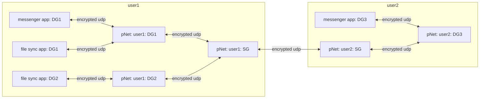
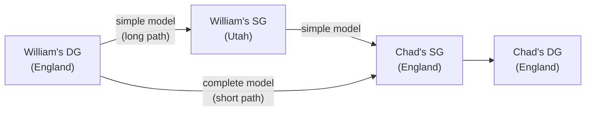
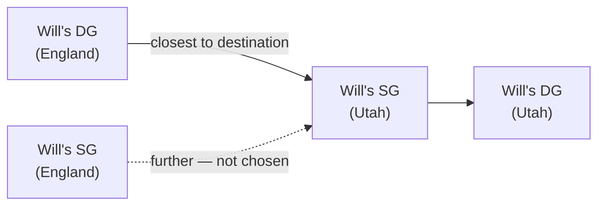

pNet devices come in two grades:

- **SG (Server Grade)**: runs on a machine with a static IP or domain name, free from NAT/firewall restrictions. If on a home network, appropriate ports are forwarded and a stable IP or DDNS is in place.
- **DG (Device Grade)**: runs on a laptop, phone, or any device that accepts whatever internet access is available. May be behind double NAT or restrictive ISP routing.

Every user on the pNet system must have at least one SG. A user's DGs do not communicate directly with other users' devices — instead they relay all outbound packets through their own SG, which forwards them to the recipient's SG, which then delivers to the appropriate DG.

Packet path: `DG_sender → SG_sender → SG_recipient → DG_recipient`



The diagram above shows how a message from the messenger app on user1's DG1 travels to user2's DG3: the DG1 pNet node forwards it to user1's SG, which relays it to user2's SG, which delivers it to DG3's pNet node, which hands it to the messenger app. It also shows how a file from the file sync app on DG1 can reach the file sync app on DG2 — both owned by user1 — via user1's SG as the relay.

pNet is responsible for maintaining network location information and encryption keys to connect and send packets to other pNet nodes, which then forward that data to the appropriate app on the device. The SG/DG split ensures reliable delivery even in difficult network environments (double NAT, advanced ISP routing) by guaranteeing that at least one reachable relay exists per user.

---

## Complete routing model — proximity-based SG selection

The simplified model always routes through the sender's own SG first. The complete model allows a DG to use any SG that belongs to either party in the conversation, choosing the geographically closest one to minimize network hops. Each device stores a latitude and longitude so distances can be computed.

**Routing algorithm (4 steps):**
1. Build the candidate SG list: all SGs owned by the sender's user **or** the recipient's user.
2. Select the closest SG from that list using device lat/long coordinates.
3. Send the packet to that SG.
4. The SG receives the packet and delivers it to the destination DG.

This means the relay hop is always as short as possible regardless of where the DG currently is, and may skip the sender's own SG entirely when the recipient's SG is closer.

### Example: William (Utah, SG in Utah) visits Chad (England, SG in England)

**William sends a message to Chad:**

Simple model path — William's DG is in England but still routes through Utah:
```
William's DG (England) → William's SG (Utah) → Chad's SG (England) → Chad's DG (England)
```

Complete model path — William's DG checks both SGs and picks Chad's SG (same continent):
```
William's DG (England) → Chad's SG (England) → Chad's DG (England)
```



**Chad sends a reply to William:**

Chad's DG checks both SGs. His own SG is in England, same as William's DG — it is the closest option, so the packet goes to Chad's SG and then directly to William's DG. In this direction the simple and complete models agree.

```
Chad's DG (England) → Chad's SG (England) → William's DG (England)
```


The complete model generalises cleanly: a DG always picks the single best relay from the full pool of SGs shared between the two users, keeping traffic local when the users are physically near each other.

### Intra-user routing (DG to DG, same user)

The algorithm is identical when both the sender and recipient belong to the same user. The candidate SG pool is simply that user's own SGs. If the user has only one SG the path is straightforward; if they have multiple SGs in different locations the proximity logic still applies and picks the best relay naturally.

**Example: Will has an SG in Utah and an SG in England. His DG in England sends a file to his DG in Utah.**

The candidate pool is `{Will's SG Utah, Will's SG England}`. The Utah SG is closest to the destination (Will's Utah DG), so it is selected as the relay.

```
Will's DG (England) → Will's SG (Utah) → Will's DG (Utah)
```



The same logic works in reverse: Will's Utah DG sending to his England DG would pick the England SG as the relay.
