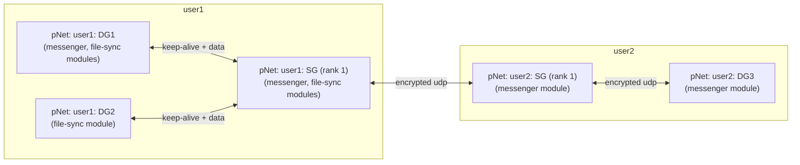
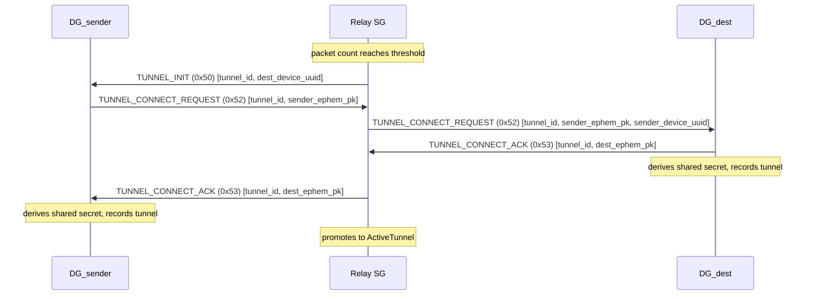

pNet devices come in two grades:

- **SG (Server Grade)**: runs on a machine with a static IP or domain name, free from NAT/firewall restrictions. If on a home network, appropriate ports are forwarded and a stable IP or DDNS is in place.
- **DG (Device Grade)**: runs on a laptop, phone, or any device that accepts whatever internet access is available. May be behind double NAT or restrictive ISP routing.

Every user on the pNet system must have at least one SG.  This is required because of how connections must be kept alive between an SG and DG to make the 2 way communication reliable.

### SG server Responsibilities and Priorities

The SG has a job to be the only device to which the DG devices owned by the user do their keep-alive communications. If a user has more than one SG device they will be ranked, so that the top-ranking SG is the one used for keep-alive. If that machine goes down (meaning it doesn't respond to keep-alive signals), the DG devices start sending their keep-alive signals to the next SG in the list.

Because only the top-ranked SG is able to send packets to the DG of that user, the rank number needs to be included in the device data of an SG.

Packet path: `DG_sender → [relay SG] → SG_recipient_top → DG_recipient`

The final hop to a recipient's DG must always go through that user's **top-ranked SG**, since it is the only SG holding an active keep-alive tunnel with the DG. The relay SG used for the first hop may be any SG from either user's pool.



The diagram shows the simple case where each user has one SG (automatically rank 1). DG1 and DG2 (both belonging to user1) maintain their keep-alive tunnels exclusively with user1's top-ranked SG. A message from user1's DG1 to user2's DG3 travels DG1 → SG1 → SG2 → DG3. Only SG2 can deliver to DG3 because it is user2's top-ranked SG and the only one holding an active tunnel to DG3. File data from DG1 to DG2 (same user) also routes through SG1 as the shared relay.

Modules are not separate processes — they are compiled into the pnet binary and run in-process on every device the user owns. A module's instance on the destination receives the packet directly via `Module::on_receive`. This includes the SG: a module enabled by the user runs on the SG too, so a messaging-shaped app can address the recipient's top-ranked SG and have its module instance there persist messages until the recipient's DG comes online.

pNet is responsible for maintaining network location information, SG rank data, and encryption keys to connect and send packets to other pNet nodes, which then dispatch that data to the appropriate module on the device. The SG/DG split ensures reliable delivery even in difficult network environments (double NAT, advanced ISP routing) by guaranteeing that at least one reachable, top-ranked relay exists per user at all times.

---

## SG selection for routing

When a DG sends a packet to a remote DG, it must route through a relay SG. The selection rule is:

1. Prefer a direct connection to the **recipient's top-ranked SG** — this is the SG that holds the active keep-alive tunnel to the recipient's DG and is the only one that can deliver to it. If a connection to that SG exists, use it (2-hop path).
2. If no direct connection to the recipient's top-ranked SG is available, fall back to the best available SG by lowest measured RTT (from `poll_sg` results), which will relay onward to the recipient's top-ranked SG.

RTT-based selection naturally favours well-connected, low-latency relays without requiring any geographic metadata.

### Intra-user routing (DG to DG, same user)

The same rule applies. All of a user's DGs keep their keep-alive with the user's rank 1 SG. That SG is always `SG_dest` for any intra-user delivery, regardless of which DG is sending or receiving. The rank 1 SG is effectively the hub for all of that user's DG traffic until a failover event promotes rank 2 to rank 1.

---

## Lazy DG-to-DG tunnels

### Motivation

In the standard routing model, every packet that passes through a relay SG is fully decrypted and then re-encrypted for the next leg of the journey. For a high-throughput use case — such as a file sync app streaming many packets between two DGs — this per-packet decrypt/re-encrypt cost at the SG adds up. A **lazy tunnel** allows the relay SG to forward packets without touching the encrypted payload, using a direct DG-to-DG shared secret negotiated automatically once traffic between a pair crosses a threshold.

### Threshold and trigger

The relay SG maintains a rolling packet count per `(sender_uuid, dest_uuid)` pair. The counter resets if the threshold is not reached within a 5-minute window. Once a pair crosses **10 packets** in a single window, the SG automatically initiates a DG-to-DG key exchange — no action is required from the apps.

### Key exchange

The exchange reuses the same X25519 ephemeral key exchange mechanism used for standard DG-to-SG connections, relayed through the SG.



### Tunnel packet forwarding

Once the tunnel is established, the sender DG encrypts directly for the destination DG using the negotiated shared secret and sends a tunnel forward packet to the relay SG. The SG forwards it without decryption.

```
DG_sender → SG:  [0x51 TUNNEL_FORWARD][sender_conn_id: u16][tunnel_id: u16][nonce: 24][ciphertext]
SG → DG_dest:    [0x54 TUNNEL_DELIVERY][tunnel_id: u16][nonce: 24][ciphertext]
```

The relay SG reads only `tunnel_id` to identify the outbound leg — the encrypted payload is forwarded as-is.

### Why this is more efficient

| | Standard packet | Tunnel packet |
|---|---|---|
| Relay SG work | decrypt → inspect → re-encrypt | read tunnel_id → forward |
| Encryption hops | DG→SG (leg 1), SG→DG (leg 2) | DG→DG (end-to-end, one key) |
| Latency benefit | baseline | lower per-packet CPU at SG |
| Best for | low-volume, ad-hoc messages | high-throughput streams (file sync, video) |

### Tunnel lifetime

The `last_used_at` timestamp on `ActiveTunnel` allows idle tunnels to be cleaned up. If no tunnel packet has been forwarded within 5 minutes, the SG removes the tunnel record and traffic falls back to the standard relay path. The DG-to-DG `ActiveConnection` expires naturally after 24 hours.
