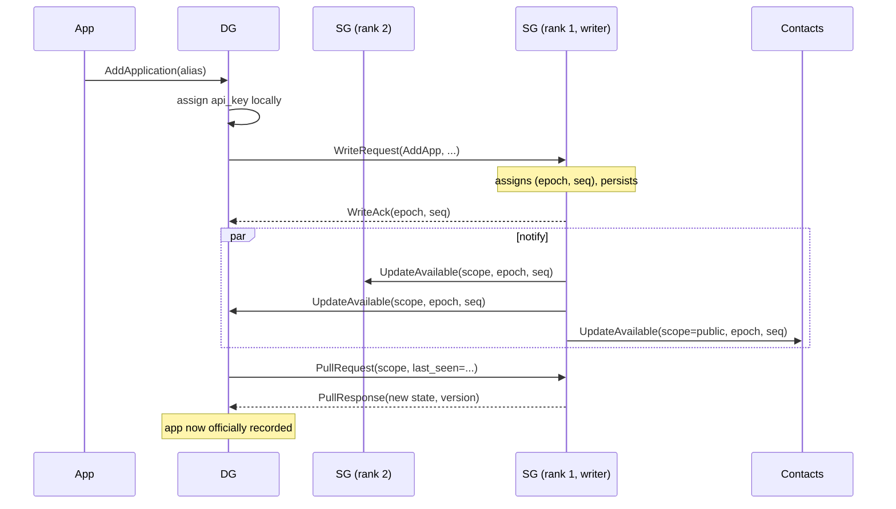

# Data Sync

This document describes how state changes propagate across pNet nodes — the user's own devices and their contacts' devices. It supersedes the ad-hoc per-change sync messages used during early development.

## Goals

- One definitive copy of state at any moment, not many copies that have to be merged on every change.
- Adding/removing apps, devices, contacts, or invitations is a single explicit operation, not a side effect of gossip.
- Missed packets are recoverable: if a node was offline or a notification was lost, it catches up on its next pull.
- A clear answer for "where do api keys go" vs "what does my contact see".

## Concepts

### Writer SG

At any moment exactly one SG acts as the **writer** for the user's data. All state-changing requests originate at a DG or SG and are sent to the writer SG. The writer assigns ordering metadata to the change, persists it, and notifies the rest of the network that an update is available.

Writer election rule:

- A DG sends writes to the **highest-rank SG it can currently reach**.
- An SG that receives a write first forwards it to the highest-rank SG *it* can reach. Only when no higher-rank SG is reachable does it accept the write itself.
- If no SG is reachable from a DG, the DG returns an error to the calling app. DGs do not buffer writes locally.

Under normal conditions this collapses to "rank 1 SG is the writer." During a rank-1 outage, rank 2 takes over. During a network partition, each side has its own writer; reconciliation rules (below) handle the rejoin.

### Sync scopes

State is split into two scopes with independent version counters:

| Scope | Visible to | Includes |
|---|---|---|
| **Private** | The user's own devices only | Application `token`/`api_key`, application `host`/port, invitations, long-term keypair, active connections, anything else that must never leave the user's device set. |
| **Public** | The user's own devices and the user's contacts | User `alias` and `uuid`, devices' `uuid`/`grade`/`sg_rank`/`hosts`, application `id` and `alias`. |

Splitting the scopes means a contact pull never touches private fields, an api-key rotation does not bump the contacts' counters, and a sync bug cannot accidentally leak a token.

### Version metadata

Every accepted write carries `(writer_sg_uuid, epoch, seq)`:

- `epoch: u32` — increments on the writer SG whenever its view of "am I the highest-rank reachable SG?" changes. A fresh boot starts at the last persisted epoch + 1.
- `seq: u64` — monotonic counter inside an epoch. Resets to 0 on epoch change.

The pair `(epoch, seq)` is a total order within a single SG's writes. Across SGs, the `writer_sg_uuid` distinguishes concurrent epochs (which only happen during a partition).

A scope's current version on a node is the highest `(writer_sg_uuid, epoch, seq)` it has applied.

## Write path

Until the originating DG completes its own pull, it may show the change locally as "pending" so the UI is not gated on the round trip — but the authoritative record is the one returned by the pull.

## Notify-then-pull

The writer SG sends a small `UpdateAvailable` notification to every interested node when a write commits. The notification carries only the scope and the new version — not the change itself. Recipients respond by issuing a `PullRequest` with the highest version they have already applied.

Pull semantics:

- `PullRequest(scope, last_seen_version)` → either a state delta with a new version, or `NoUpdates`.
- Pulls are idempotent. A duplicate pull returns the same response.
- Notifications are best-effort. A lost notification is corrected by the next periodic pull, so correctness never depends on notification delivery.

## Periodic and on-reconnect pull

Every node issues a pull on its own schedule independent of notifications:

- On reconnect to an SG (after coming online or after a connection refresh).
- On a periodic timer while online — initial value: every few hours.

This makes the system self-healing: a node that misses every notification for a day will still converge on its next periodic pull.

## Visibility split in practice

- **User's own devices** pull both scopes from the writer SG.
- **Contacts' devices** pull only the public scope, and only via their own writer SG. A contact's SG fetches the public scope from the user's writer SG on the contact's behalf, so contacts do not connect directly to the user's writer for sync.
- The contact-side writer SG caches the public scope locally and serves its own DGs from that cache.

## Failover and writer handoff

When the rank-1 SG goes down:

1. DGs detect the outage via their existing `poll_sg` results and start sending writes to rank 2.
2. Rank 2 observes that no higher-rank SG is reachable, increments its `epoch`, and accepts writes.
3. While serving as writer, rank 2 also notifies the user's other devices and the user's contacts, exactly as rank 1 did.
4. When rank 1 comes back online, it and rank 2 reconcile (next section). After reconciliation, rank 1 resumes as writer and rank 2 returns to forwarding.

If **all** SGs are unreachable from a DG, the DG returns an error to the requesting app. No local queueing.

## Reconciliation on rejoin

When two SGs that have both been writers reconnect, they exchange their write logs since the last shared `(writer_sg_uuid, epoch, seq)` watermark.

Two cases:

1. **Sequential** — only one side accepted writes during the split (e.g., rank 1 was simply down). The returning SG fetches the other side's writes and applies them in order. No conflicts.
2. **Concurrent** — both sides accepted writes (a true partition). Apply each side's writes in `(epoch, seq)` order, resolving any per-field conflict using the rules below.

After reconciliation the SGs share a common watermark and the higher-rank SG resumes as writer.

## Field-level merge rules

These rules apply only when concurrent writes touch the same field during a partition.

| Change kind | Rule |
|---|---|
| Add (application, device, contact, invitation) | **Union.** All adds from both sides are kept. Identity is by UUID; if two sides happen to allocate the same `application.id` (a `u16`), the writer with higher SG rank keeps the id and the other is reassigned at merge time. |
| Remove (any of the above) | **Tombstone wins.** A remove on either side overrides a concurrent add or modification of the same record. Removes are recorded as tombstones in the write log so a late-arriving add from the partitioned side cannot resurrect the record. |
| Scalar update (`alias`, `sg_rank`, `hosts`, etc.) | **Highest writer-rank wins.** Tie broken by `(epoch, seq)`. |

These rules are deliberately small. Most users on a small home pNet will never trigger them; they exist so the system has a defined answer when they do.

## Implementation phasing

- **v1**: writer election, version metadata, notify-then-pull, periodic pull, scope split, sequential rejoin (rank 1 was simply down). Concurrent-partition reconciliation rules are documented but not yet implemented; on detection of concurrent epochs the SGs log and refuse to merge until manual intervention.
- **v2**: implement the field-level merge rules and tombstone log so true partitions heal automatically.

The v1 cut covers the common failure modes (rank-1 outage, missed notifications, devices going offline) without writing the partition-merge code, which is rarely exercised on small networks.

## Open questions

- Wire format for `WriteRequest`/`WriteAck`/`UpdateAvailable`/`PullRequest`/`PullResponse` — to be defined alongside the existing op codes in `pnet to pnet communication.md`.
- How long an SG retains its write log for rejoin reconciliation. A bounded retention (e.g., 30 days) with a "fall back to full state transfer" path if a peer has been offline longer.
- Periodic pull interval — start with every few hours, tune from telemetry.
